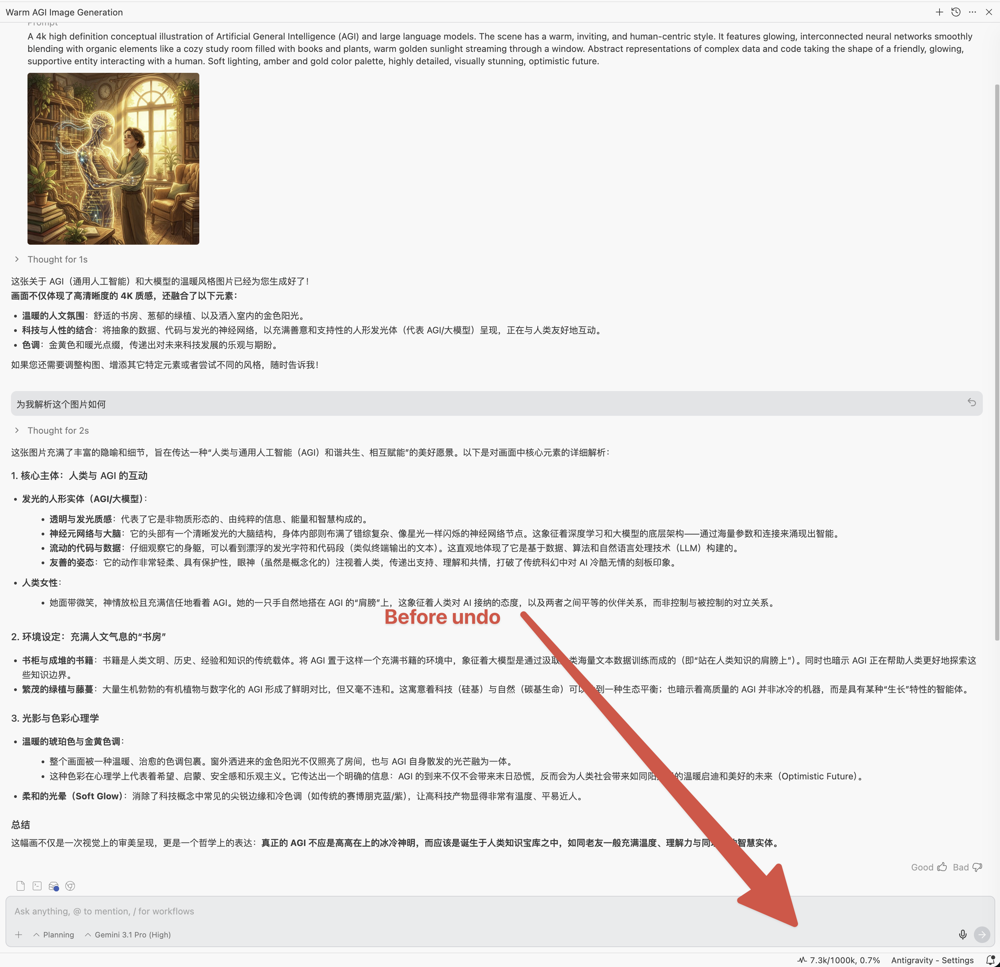
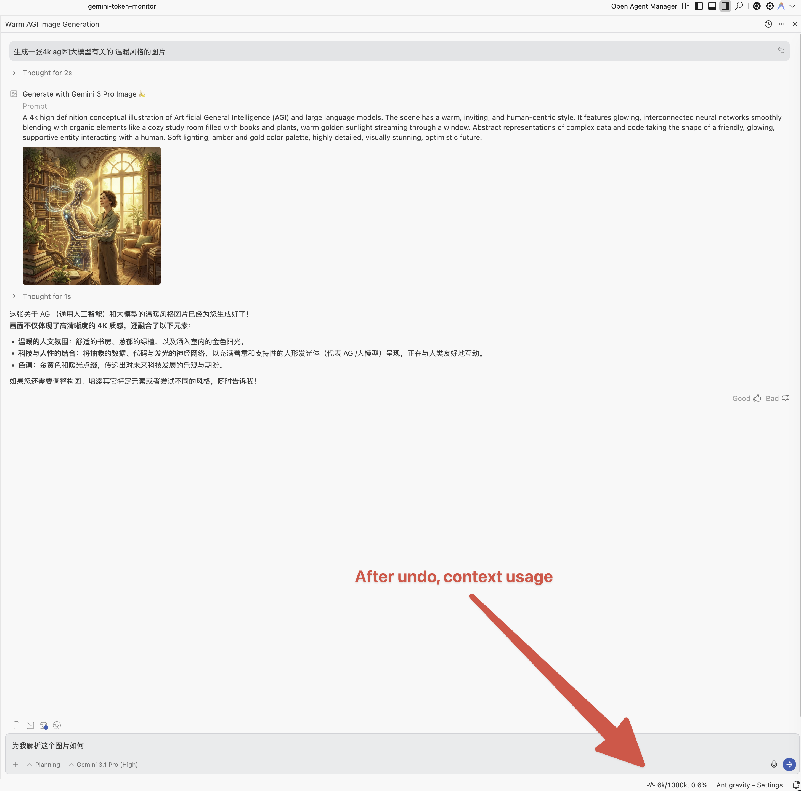
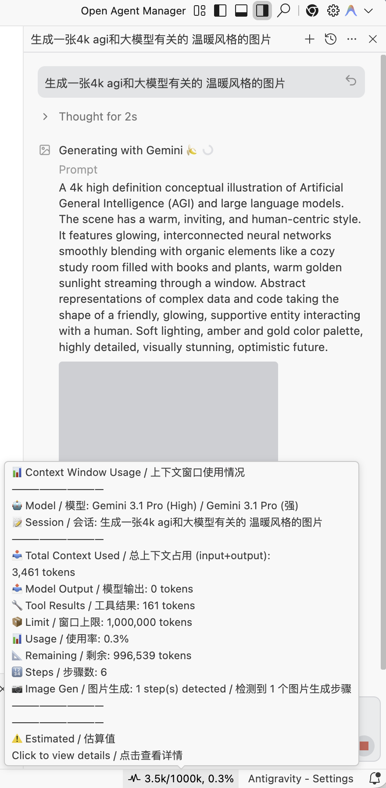
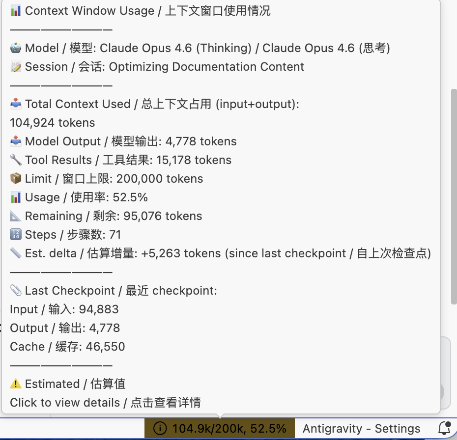
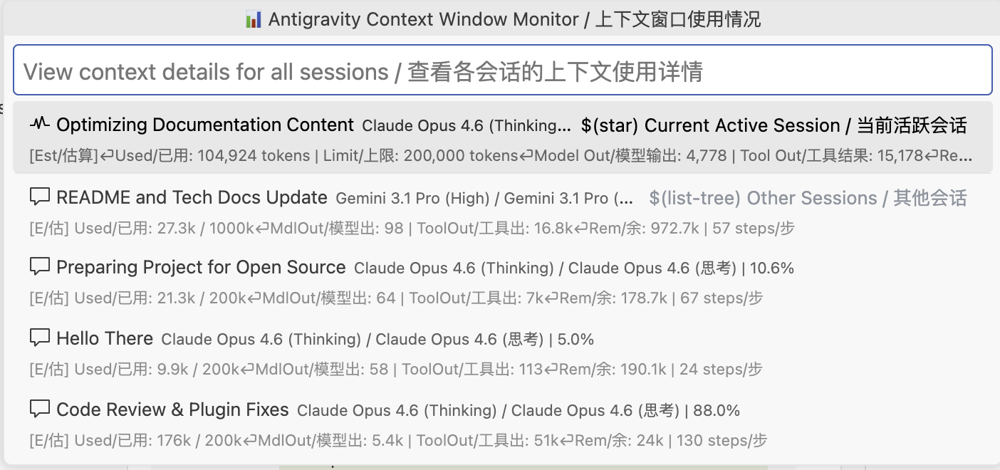

# 🌌 Antigravity Context Window Monitor / 实时上下文窗口监控

一个专为 **Antigravity**（Google 基于 Windsurf 修改的 IDE）开发的插件，用于实时**监控所有聊天会话的上下文窗口使用情况**。

A plugin built for **Antigravity** (Google's Windsurf-based IDE) that provides real-time monitoring of context window usage across all your chat sessions.

---

> [!WARNING]
> **平台支持 / Platform Support**
>
> 🍏 **macOS**: 当前支持。通过 `ps` 和 `lsof` 命令实现进程发现。
> macOS: Fully supported. Uses `ps` and `lsof` for process discovery.
>
> 🪟 **Windows**: 开发中，敬请期待。
> Windows: Coming soon.

---

## 📚 技术细节 / Technical Details

👉 **[阅读技术实现说明 / Read the Technical Implementation Guide](docs/technical_implementation.md)**

---

## ✨ 主要功能 / Features

* **⚡ 实时 Token 监控 / Real-Time Token Usage**
    状态栏显示当前 Token 消耗，格式如 `125k/200k, 62.5%`。Token 数据优先取自模型 checkpoint 的精确值（`inputTokens` + `outputTokens`），两次 checkpoint 之间通过基于实际文本内容的字符估算实时计算增量（v1.4.0 起替代了固定常量）。仅在步骤数据结构缺失时 fallback 到固定常量。
    Shows current token consumption in the status bar (e.g. `125k/200k, 62.5%`). Token data comes from model checkpoint values when available, with content-based character estimation between checkpoints (replaces fixed constants since v1.4.0). Fixed constants are only used as fallback when step data structure is missing.

* **🌐 中英双语 / Bilingual Interface**
    状态栏、QuickPick 面板、tooltip 均提供中英文显示。
    Full Chinese/English support across status bar, QuickPick panel, and tooltips.

* **🔒 多窗口隔离 / Multi-Window Isolation**
    每个 Antigravity 窗口只显示本工作区的对话数据。插件通过 workspace URI 过滤，多窗口之间互不干扰。
    Each Antigravity window only shows conversations belonging to its workspace, filtered by workspace URI.

* **🗜️ 上下文压缩检测 / Context Compression Detection**
    当模型自动压缩对话历史时，插件通过双层检测机制识别：主层比较连续 checkpoint 的 `inputTokens`（下降超过 5000 tokens 即判定，天然免疫 Undo 误报），降级层比较跨轮询 `contextUsed` 变化（带 Undo 排除守卫）。状态栏显示 `~100% 🗜` 压缩标识。
    When the model auto-compresses conversation history, the plugin detects it via two-layer detection: primary layer compares consecutive checkpoint `inputTokens` (drop > 5000 tokens, immune to Undo false positives), fallback layer compares cross-poll `contextUsed` (with Undo exclusion guard). Shows `~100% 🗜` in the status bar.

* **⏪ Undo/Rewind 支持 / Undo/Rewind Support**
    撤销对话步骤后，插件检测到 `stepCount` 减少，会重新计算 Token 用量，显示回滚后的准确值。
    When you undo a conversation step, the plugin detects the `stepCount` decrease and recalculates token usage to reflect the rollback.

    | 回退前 / Before Undo | 回退后 / After Undo |
    | :---: | :---: |
    |  |  |

* **🔄 动态模型切换 / Dynamic Model Switching**
    对话中切换模型时，上下文窗口上限自动更新为当前模型的限制值。v1.4.0 起通过 `GetUserStatus` API 动态获取模型显示名称。
    When switching models mid-conversation, the context window limit automatically updates to match the new model. Since v1.4.0, model display names are dynamically fetched via the `GetUserStatus` API.

* **🎨 图片生成追踪 / Image Generation Tracking**
    使用 Gemini Pro 对话中调用 Nano Banana Pro 生成图片时，相关 Token 消耗会被计入，tooltip 中以 `📷` 标记。检测逻辑基于 step type 和 generator model 名称匹配。
    When Nano Banana Pro is invoked for image generation during Gemini Pro conversations, the associated token consumption is tracked and marked with `📷` in the tooltip. Detection is based on step type and generator model name matching.

    

* **🛌 自动退避轮询 / Exponential Backoff Polling**
    语言服务器不可用时，轮询间隔按 `baseInterval × 2^n` 递增（默认 5s → 10s → 20s → 60s），重连后立即恢复正常间隔。
    When the language server is unreachable, polling interval increases as `baseInterval × 2^n` (default: 5s → 10s → 20s → 60s), resetting immediately on reconnection.

## 🤖 支持的模型 / Supported Models

| 模型 / Model | Internal ID | 上下文上限 / Context Limit |
| --- | --- | --- |
| Gemini 3.1 Pro (High) | MODEL_PLACEHOLDER_M37 | 1,000,000 |
| Gemini 3.1 Pro (Low) | MODEL_PLACEHOLDER_M36 | 1,000,000 |
| Gemini 3 Flash | MODEL_PLACEHOLDER_M18 | 1,000,000 |
| Claude Sonnet 4.6 (Thinking) | MODEL_PLACEHOLDER_M35 | 200,000 |
| Claude Opus 4.6 (Thinking) | MODEL_PLACEHOLDER_M26 | 200,000 |
| GPT-OSS 120B (Medium) | MODEL_OPENAI_GPT_OSS_120B_MEDIUM | 128,000 |

*模型 ID 来自 Antigravity 本地语言服务器的 `GetUserStatus` API。如果新增了模型，可以在 IDE 设置中手动覆盖上下文上限。*
*Model IDs are fetched from the local Antigravity language server's `GetUserStatus` API. If new models are added, you can override context limits in IDE settings.*

## 🚀 使用方法 / Usage

1. **安装 / Install**:
   * **OpenVSX**: 直接从 [Open VSX Registry](https://open-vsx.org/extension/AGI-is-going-to-arrive/antigravity-context-monitor) 安装。
     Install directly from [Open VSX Registry](https://open-vsx.org/extension/AGI-is-going-to-arrive/antigravity-context-monitor).
   * **手动安装 / Manual**: 通过"扩展 → 从 VSIX 安装"将 `.vsix` 文件安装到 Antigravity IDE。
     Or install the `.vsix` file via Extensions → Install from VSIX.
2. **查看状态 / Status Bar**: 右下角状态栏显示当前上下文使用情况（空白聊天时显示 `0k/1000k, 0.0%`）。
   The bottom-right status bar shows current context usage (displays `0k/1000k, 0.0%` for empty chats).
3. **悬停详情 / Hover**: 将鼠标悬停在状态栏项上，查看详细信息（模型、输入/输出 Token、剩余容量、压缩状态、图片生成步骤等）。
   Hover over the status bar item for detailed info (model, input/output tokens, remaining capacity, compression status, image gen steps, etc.).

   

4. **点击查看 / Click**: 点击状态栏项，弹出 QuickPick 面板显示当前工作区所有被追踪的会话。
   Click the status bar item to open a QuickPick panel listing all tracked sessions in this workspace.

   

## ⚠️ 已知限制 / Known Limitations

> [!IMPORTANT]
> **同一工作区多窗口 / Same-Workspace Multi-Window**
> 如果在**同一个文件夹**上打开多个 Antigravity 窗口，它们共享相同的 workspace URI，会话数据可能会混合。
> If you open multiple Antigravity windows on the **same folder**, they share the same workspace URI, and session data may overlap.
>
> **解决方法 / Solution**: 不同窗口打开不同的文件夹。
> Open different folders in different windows.

> [!NOTE]
> **上下文压缩提示 / Compression Notification**
> 压缩完成通知（🗜 图标）持续约 15 秒（3 个轮询周期）后恢复正常显示。
> The compression notification (🗜 icon) shows for ~15 seconds (3 poll cycles) before reverting to normal display.

> [!NOTE]
> **新对话默认显示 / Default Display for New Conversations**
> 新建对话时，状态栏默认显示 `0k/1000k, 0.0%`（1000k 为 Gemini 系列模型的默认上下文上限）。**只有在与模型产生实际对话后**，插件才会从语言服务器获取到会话数据并更新状态栏显示。
> When you start a new conversation, the status bar defaults to `0k/1000k, 0.0%` (1000k is the default context limit for Gemini models). The display **only updates after you interact with the model**, as the plugin needs the language server to register the conversation before it can fetch usage data.

## ⚙️ 设置 / Settings

| 设置项 / Setting | 默认 / Default | 说明 / Description |
| --- | --- | --- |
| `pollingInterval` | 5 | 轮询频率（秒） / Polling interval in seconds |
| `contextLimits` | (见默认值) | 手动覆盖模型的上下文上限 / Override context limits per model |

## ⭐ Star History

---
**作者 / Author**: AGI-is-going-to-arrive
**版本 / Version**: 1.5.3
