# 🌌 Antigravity 实时上下文窗口监控

一个专为 **Antigravity IDE** 开发的插件，用于实时**监控所有聊天会话的上下文窗口使用情况**。

**[🇺🇸 English Documentation / 英文文档](README.md)**

---

> [!WARNING]
> **平台支持**
>
> 🍏 **macOS**: 完全支持。通过 `ps` 和 `lsof` 命令实现进程发现。**1.16.18 VSIX 已安装到运行中的 Antigravity IDE 2.5.5，并完成包含窗口重载的实机验证。**
>
> 🐧 **Linux**: 自 v1.6.0 起支持。通过 `ps` 和 `lsof`/`ss` 实现进程发现。历史平台测试覆盖 Ubuntu 22.04 (x64 & ARM64)。
>
> 🪟 **Windows**: 完全支持（v1.8.0+）。通过 `wmic` 缓存和 PowerShell 回退机制优化了发现逻辑。
>
> 🐧🪟 **WSL**: 完全支持（v1.12.0+）。通过 `/proc/version` 检测 WSL 环境，利用 WSL 互操作调用 Windows 端工具进行 LS 发现。v1.12.1 新增 `extensionKind: ["ui", "workspace"]`，通过 Remote-WSL 或 Remote SSH 连接时扩展自动运行在本地 Windows 宿主机上。v1.13.0 新增 **Remote-WSL LS 发现** — 连接 WSL 工作区时，扩展通过 `wsl -d <distro>` 发现 WSL 内部运行的 `language_server_linux_x64` 进程，通过 WSL2 端口转发连接并显示正确的上下文数据。

---

**1.16.18 验证：** 本地 TypeScript 编译和 **26 个文件的全部 362 项测试**通过。Windows、macOS 和 Linux 的编译/测试结果见 [GitHub Actions](https://github.com/AGI-is-going-to-arrive/Antigravity-Context-Window-Monitor/actions/workflows/verify.yml)；本次原生 IDE 验证环境为 macOS。详见[发布验收说明](docs/releases/1.16.18.md#验证)。

## 📚 技术细节

👉 **[阅读技术实现说明](docs/technical_implementation.md)**

---

## ✨ 主要功能

* **⚡ 实时 Token 监控**
    状态栏显示当前 Token 消耗，格式如 `125k/200k, 62.5%`。Token 数据优先取自模型 checkpoint 的精确值（`inputTokens` + `outputTokens`），两次 checkpoint 之间通过基于实际文本内容的字符估算实时计算增量（v1.4.0 起替代了固定常量）。仅在步骤数据结构缺失时 fallback 到固定常量。

* **🪪 状态栏计划层级显示稳定**
    当 Antigravity 后续轮询不再返回最新 `userTierName` 时，状态栏悬浮提示会主动清空旧的二级计划/层级后缀，避免过期标签在后续轮询中残留。

* **🌐 语言切换**
    用户可选择仅中文、仅英文或双语显示模式。点击状态栏 → 设置 → 切换显示语言即可访问。偏好通过 `globalState` 跨会话持久化。

* **🔒 多窗口隔离**
    每个 Antigravity 窗口优先显示本工作区的对话数据，通过 workspace URI 过滤。遇到 Antigravity 切换项目后仍上报旧 workspace 的情况，监控会跟随共享语言服务器里当前 RUNNING 的对话，避免状态栏直接空掉。未打开文件夹的窗口显示所有对话。

* **🗜️ 上下文压缩检测**
    当模型自动压缩对话历史时，插件通过双层检测机制识别：主层比较连续 checkpoint 的 `inputTokens`（下降超过 5000 tokens 即判定，天然免疫 Undo 误报），降级层比较跨轮询 `contextUsed` 变化（带 Undo 排除守卫）。状态栏显示 `~100% 🗜` 压缩标识。

* **⏪ Undo/Rewind 支持**
    撤销对话步骤后，插件检测到 `stepCount` 减少，会重新计算 Token 用量，显示回滚后的准确值。

    | 回退前 | 回退后 |
    | :---: | :---: |
    | 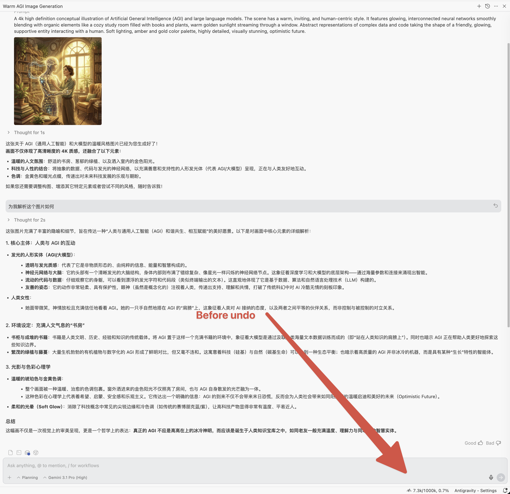 | 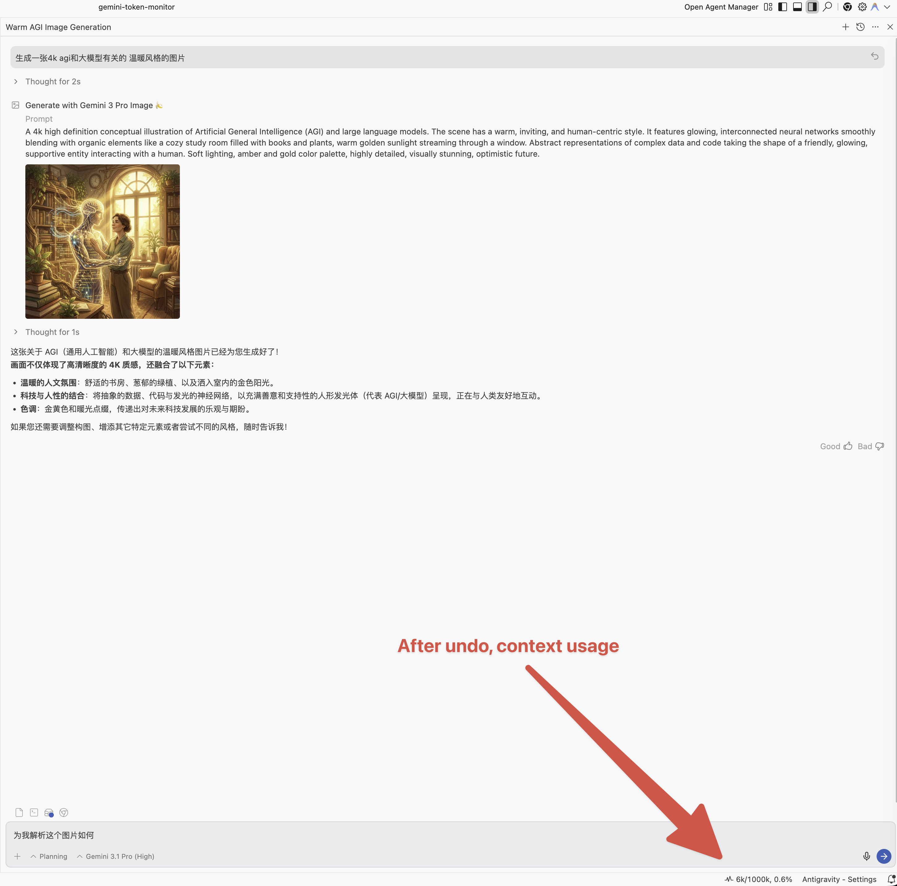 |

* **🔄 动态模型切换**
    对话中切换模型时，上下文窗口上限自动更新为当前模型的限制值。v1.4.0 起通过 `GetUserStatus` API 动态获取模型显示名称。

* **🎨 图片生成追踪**
    使用 Gemini Pro 对话中调用 Nano Banana Pro 生成图片时，相关 Token 消耗会被计入，tooltip 中以 `📷` 标记。检测逻辑基于 step type 和 generator model 名称匹配。

    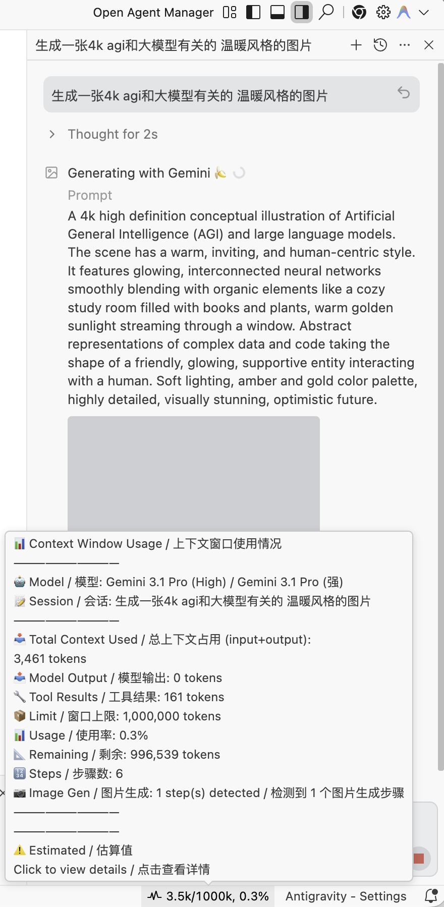

* **🛌 自动退避轮询**
    语言服务器不可用时，轮询间隔按 `baseInterval × 2^n` 递增，采用双上限策略：发现失败上限 15 秒（5s → 10s → 15s，快速检测 LS），RPC 失败上限 60 秒。重连后立即恢复正常间隔。

* **📊 WebView 监控面板** *(v1.10.1 新增)*
    点击状态栏打开侧边面板全景仪表盘。展示账户计划与等级、Prompt / Flow Credits（额度）余额、每模型配额使用量（带颜色进度条）、功能开关、团队配置（MCP Servers、Auto-Run 等）、Google AI 额度。所有数据来自已有的 `GetUserStatus` API——零额外网络请求。
    * **🛡️ 隐私遮罩**：面板顶部盾牌按钮可遮罩姓名和邮箱，开关状态跨刷新持久化。
    * **📂 可折叠区域**：次要信息（计划限制、功能开关、团队配置、Google AI 额度）默认折叠，展开/收起状态持久化。

* **⚙️ 交互式设置仪表盘** *(v1.11.0 新增，持续增强至 v1.16.9)*
    设置页提供图形化界面，可直接配置轮询、低额度警告、状态栏内容、界面缩放和面板显示偏好。
    * **🟢 状态栏额度指示灯**：当前模型的配额百分比带彩色状态灯（`🟢`、`🟡`、`🔴`）直接显示在状态栏上。
    * **⏳ 当前模型重置倒计时**：状态栏倒计时现在跟随你当前正在使用的模型的重置时间，而不再是所有模型中最早的那个。
    * **🎛️ 状态栏显示开关**：独立开关控制「上下文用量」、「额度指示灯」、「重置倒计时」与「AI 积分余额」的显示/隐藏。
    * **⚡ 状态栏 AI 积分** *(v1.16.7)*：状态栏新增 AI 积分余额段（如 `⚡14,701`），使用 `||` 包裹格式（如 `|| ⚠ 121.2k/160k || 🟡40% || ⏳4h6m || ⚡14,701 ||`）。积分为零时自动隐藏。可在设置页通过 `statusBar.showAiCredits` 开关控制。
    * **📆 按账号独立到期日** *(v1.16.7)*：在个人页内联设置每个账号的月度积分到期日（1-31）。个人页、账号面板和状态栏 tooltip 都会显示「今日到期 / X 天后到期 / 到期日未设置」倒计时徽章。使用 durable JSON 持久化，卸载重装不丢失。采用 UTC 日历日差计算，跨夏令时也不会多算 1 天。
    * **⏸️ 暂停/恢复**：暂停自动刷新以冻结面板数据，方便排查问题。

* **🧠 模型活动监控** *(v1.11.2 新增，持续增强至 v1.16.4)*
    新增活动标签页，实时追踪 AI 推理调用、工具使用、Token 消耗和每模型耗时。通过主状态栏或 `Show Model Activity` 命令访问。
    * **🔧 工具名称显示** *(v1.11.3)*：时间线条目显示工具名称（如 `view_file`、`gh/search_issues`）和步骤序号标签。
    * **📚 工具目录清理** *(v1.16.4)*：GM 数据页提供可折叠工具目录、智能 chip tooltip，以及只清空目录、不影响工具排行计数的清理按钮。
    * **⚡ 独立 Activity 轮询** *(v1.11.3)*：Activity 追踪运行在独立的 3 秒轮询循环中，与全局 5 秒轮询解耦，更新更快。
    * **🎯 三层额度检测** *(v1.12.2)*：即时检测（周期内已用时间比较）、漂移检测（resetTime 观察）、额度检测（fraction 变化）。不再使用硬编码周期——自动适配任何额度周期。
    * **🔀 归档防抖合并** *(v1.12.2)*：不同配额池在 5 分钟内先后重置时自动合并为单条归档，避免碎片化。
    * **💾 数据持久化**：活动统计通过 `globalState` 跨 VS Code 重启保存，写入频率限制为每 30 秒一次。
    * **📋 自动归档**：模型额度重置时，当前活动自动归档到历史记录，带来源追踪（`triggeredBy`），生成每周期使用报告。
    * **📊 推算步数**：当对话超过 LS API 约 500 步获取窗口时，额外步数以推算方式记录，UI 上以 `📊` 标记明确区分。
    * **⚠️ 低额度通知**：当任意模型剩余额度低于可配置阈值（默认 20%）时弹出警告通知。

## 🤖 支持的模型

注册表识别当前模型及历史记录中的旧模型身份。模型页始终以当前登录账号的实时 picker 为准；已注册不代表所有账号都能使用。

| 模型 | Internal ID / 内部 ID | 平台压缩上限 |
| --- | --- | --- |
| Gemini 3.8 Flash (High) *（平台默认）* | MODEL_PLACEHOLDER_M318 | 256,000 |
| Gemini 3.8 Flash (Medium) | MODEL_PLACEHOLDER_M319 | 256,000 |
| Gemini 3.8 Flash (Low) | MODEL_PLACEHOLDER_M320 | 256,000 |
| Gemini 3.8 Flash (Tiered，内部路由) | MODEL_PLACEHOLDER_M322 | 256,000 |
| Gemini 3.7 Flash (High) | MODEL_PLACEHOLDER_M298 | 256,000 |
| Gemini 3.7 Flash (Medium) | MODEL_PLACEHOLDER_M299 | 256,000 |
| Gemini 3.7 Flash (Low) | MODEL_PLACEHOLDER_M300 | 256,000 |
| Gemini 3.6 Flash (High) | MODEL_PLACEHOLDER_M71 | 256,000 |
| Gemini 3.6 Flash (Medium) | MODEL_PLACEHOLDER_M72 | 256,000 |
| Gemini 3.6 Flash (Low) | MODEL_PLACEHOLDER_M73 | 256,000 |
| Gemini 3.6 Flash (Tiered, 内部档) | MODEL_PLACEHOLDER_M196 | 256,000 |
| Gemini 3.5 Flash (High) | MODEL_PLACEHOLDER_M84 | 256,000 |
| Gemini 3.5 Flash (Medium) | MODEL_PLACEHOLDER_M20 | 256,000 |
| Gemini 3.5 Flash (Low) | MODEL_PLACEHOLDER_M187 | 256,000 |
| Gemini 3.1 Pro (High) | MODEL_PLACEHOLDER_M16 | 128,000 |
| Gemini 3.1 Pro (Low) | MODEL_PLACEHOLDER_M36 | 128,000 |
| Claude Opus 5.5 (Low) | MODEL_PLACEHOLDER_M400 | 256,000 |
| Claude Opus 5.5 (Medium) | MODEL_PLACEHOLDER_M401 | 256,000 |
| Claude Opus 5.5 (High) | MODEL_PLACEHOLDER_M402 | 256,000 |
| Claude Sonnet 5.5 (Low) | MODEL_PLACEHOLDER_M403 | 256,000 |
| Claude Sonnet 5.5 (Medium) | MODEL_PLACEHOLDER_M404 | 256,000 |
| Claude Sonnet 5.5 (High) | MODEL_PLACEHOLDER_M405 | 256,000 |
| Claude Sonnet 4.6 (Thinking) | MODEL_PLACEHOLDER_M35 | 160,000 |
| Claude Opus 4.6 (Thinking) | MODEL_PLACEHOLDER_M26 | 160,000 |
| GPT-OSS 120B (Medium) | MODEL_OPENAI_GPT_OSS_120B_MEDIUM | 80,000 |
| Gemini 3 Flash（仅目录可见，不进 picker） | MODEL_PLACEHOLDER_M18 | 128,000 |
| 历史（已退役 / 已改号） | MODEL_PLACEHOLDER_M264 / M265 / M266 / M133 / M132 / M47 | 仅用于归档数据解析 |

*这些数值是 Antigravity 平台压缩上限，不是模型原生上下文窗口。模型 ID 和实时参数来自 Antigravity 本地语言服务器，实时参数优先于静态兜底。在实时参数到达前，Claude 5.5 使用 255,000 token 静态兜底；已核实的实时上限为 256,000。*

> [!NOTE]
> **v1.16.18 中的 Claude 5.5：** 2026-10-03 对运行中的 Antigravity IDE 进行元数据探测，核实了 Opus/Sonnet 的 Low / Medium / High 全部六个条目。它们均为 **1,000,000 token 原生上下文**、**128,000 token 最大输出**和 **256,000 token 平台压缩上限**。思考方式为自适应，API 提供 1 / 2 / 3 档位，而非固定 token 预算。内部 checkpointer 的独立参数 `tokenThreshold` 为 50,000，与卡片显示的压缩上限不同。
> **账号可用性：** 付费 Pro/Ultra 账号已逐步提供 Claude 5.5，部分非付费账号仍提供 Claude 4.6。本扩展保留 4.6 支持与历史身份解析，也支持第三方模型移除后仅含 Gemini 的 picker。插件不会授予模型访问权限，也不会硬编码订阅名或移除日期；展示范围由当前账号的实时模型列表决定。
> Gemini 3.8 Flash 的 High / Medium / Low 分别使用 `M318` / `M319` / `M320`；仅目录可见的 tiered 路由使用 `M322`。即使 Gemini 3.5 不在账号 picker 中，仍保留注册以兼容目录与历史数据。
> `MODEL_PLACEHOLDER_Mxxx` 编号由平台分配，**可能在无预警的情况下被改号**——Gemini 3.6 Flash 三档已于 2026 年 8 月从 `M264` / `M265` / `M266` 改为 `M71` / `M72` / `M73`。本扩展保留旧编号的注册，使历史用量数据仍能解析到正确模型，并把新旧编号合并为同一条成本行、同一个配额池。来自语言服务器的活体 checkpointer 参数始终优先于上表的静态值。

以下为 [Claude 5.5 官方 API 参考价格](https://platform.claude.com/docs/en/about-claude/pricing)，单位为美元/百万 token（2026-10-03）：

| 模型 | 输入 | 输出 | 缓存读取 | 缓存写入，5 分钟 | 缓存写入，1 小时 |
| --- | --- | --- | --- | --- | --- |
| Claude Opus 5.5 | $4 | $20 | $0.20 | $5 | $8 |
| Claude Sonnet 5.5 | $2 | $10 | $0.20 | $2.50 | $4 |

内置缓存写入参考费率为 **5 分钟**。当前费用估算不计缓存创建费，因为遥测不能可靠区分创建 token 及其存活时间（TTL）；1 小时缓存写入费用也不自动计入。已上报的缓存读取 token 会参与计价。这些费用只是本地 API 等价估算，不代表 Antigravity 订阅账单。

Gemini 3.8 Flash 与 3.7 Flash 使用相同的引入期定价：截至 2026-12-31，**每 1M 输入 token $0.75**、**每 1M 输出 token $3.75**；从 2027-01-01 起变为 $1.50 / $7.50。来源：[Google Antigravity 发布文](https://antigravity.google/blog/gemini-3-8-flash-in-google-antigravity)与 [Google 模型公告](https://blog.google/innovation-and-ai/models-and-research/gemini-models/3-8-flash-and-3-8-flash-cyber/)。

## 🚀 使用方法

1. **安装**:
   * **OpenVSX**: 直接从 [Open VSX Registry](https://open-vsx.org/extension/AGI-is-going-to-arrive/antigravity-context-monitor) 安装。
   * **手动安装**: 通过"扩展 → 从 VSIX 安装"将 `.vsix` 文件安装到 Antigravity IDE。
2. **查看状态**: 右下角状态栏显示当前上下文使用情况（空白聊天使用当前/默认模型阈值）。
3. **悬停详情**: 将鼠标悬停在状态栏项上，查看详细信息（模型、输入/输出 Token、剩余容量、压缩状态、图片生成步骤、每模型配额摘要，以及最近 checkpoint 的影子模型标识等）。

   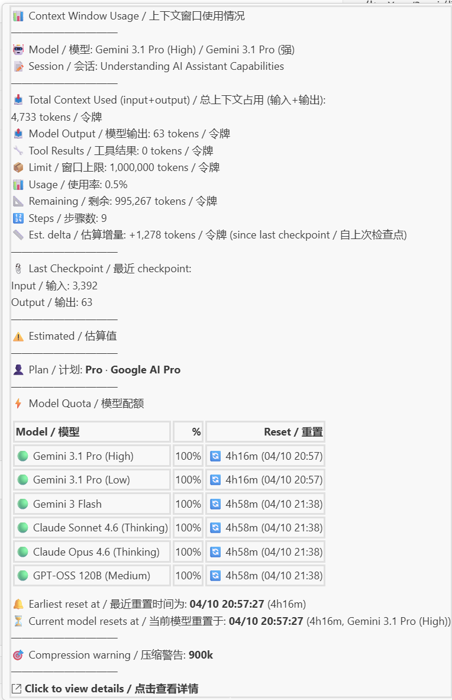

4. **点击查看 — WebView 监控面板**: 点击状态栏项，打开综合性 **8 标签页监控仪表盘**：

   **总览**（现位于 GM 数据标签页内）— 额度概览、GM 快照、成本快照、活跃会话详情（含输出分解和 LLM 调用明细）。

   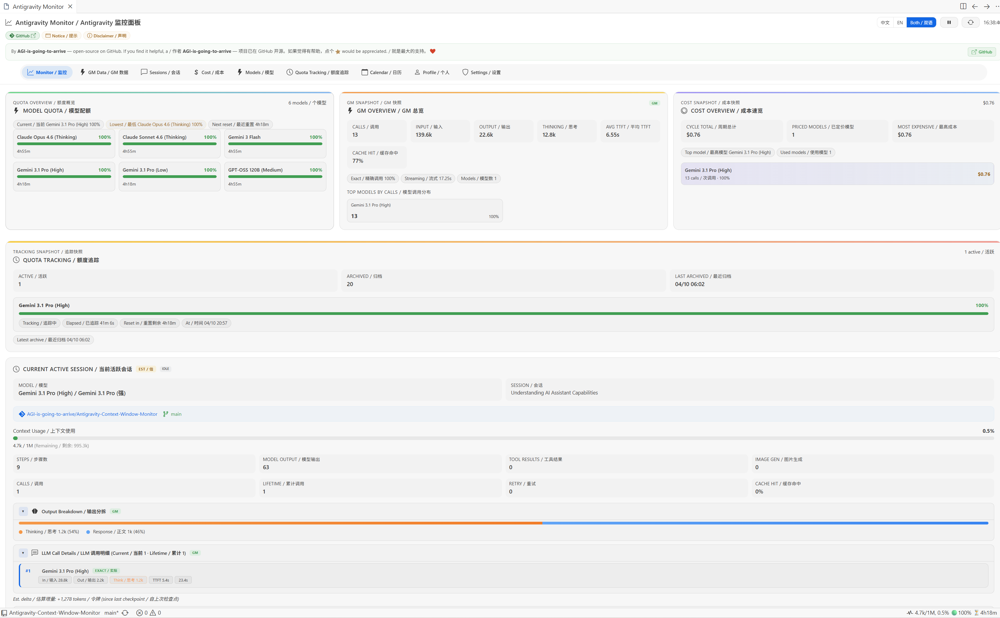

   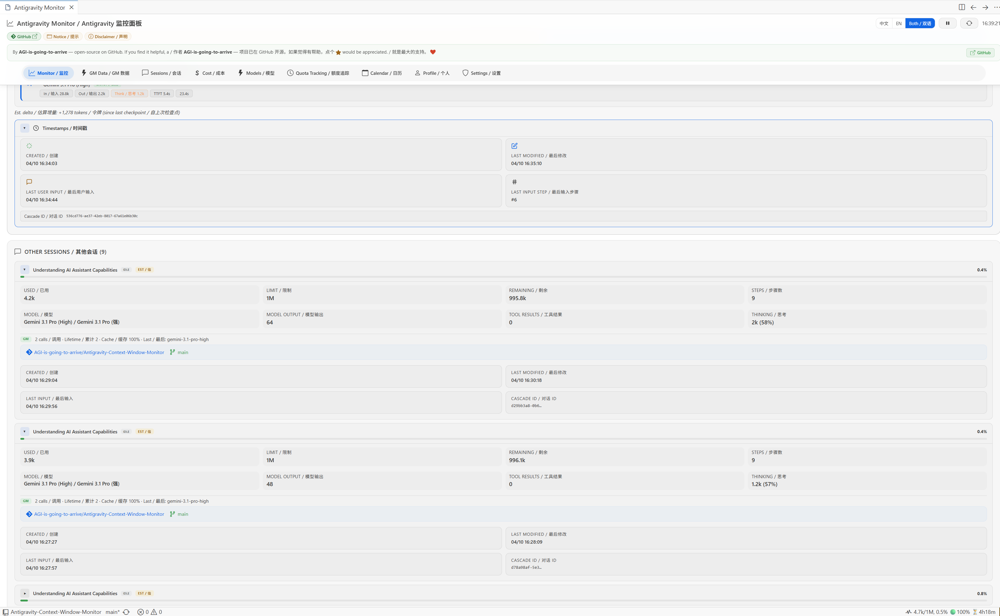

   **GM 数据 (GM Data)** — 每模型 Token 用量明细、调用次数、缓存命中率、重试统计、工具排行和可折叠工具目录。

   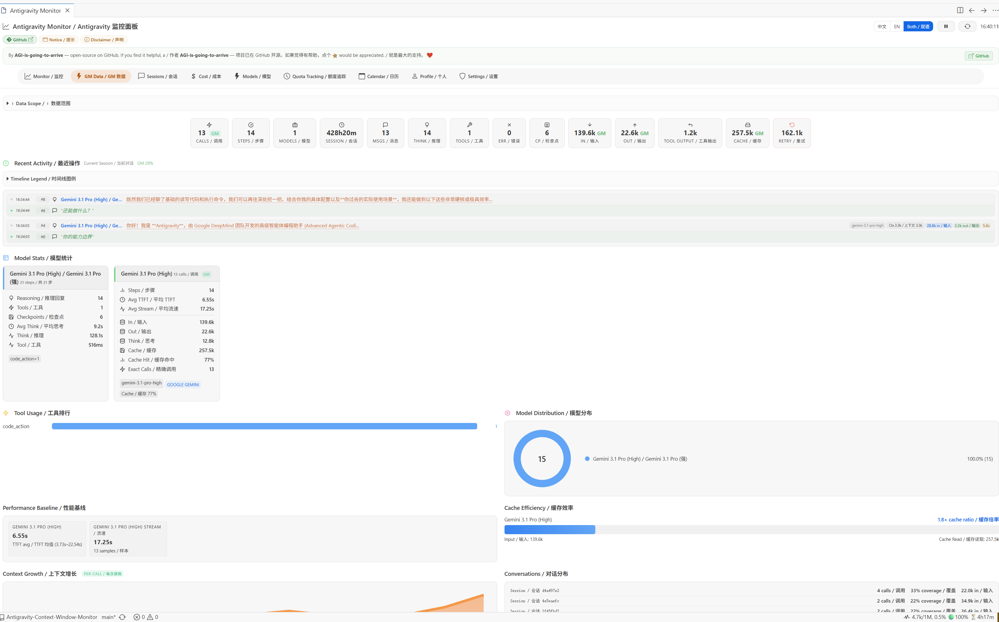

   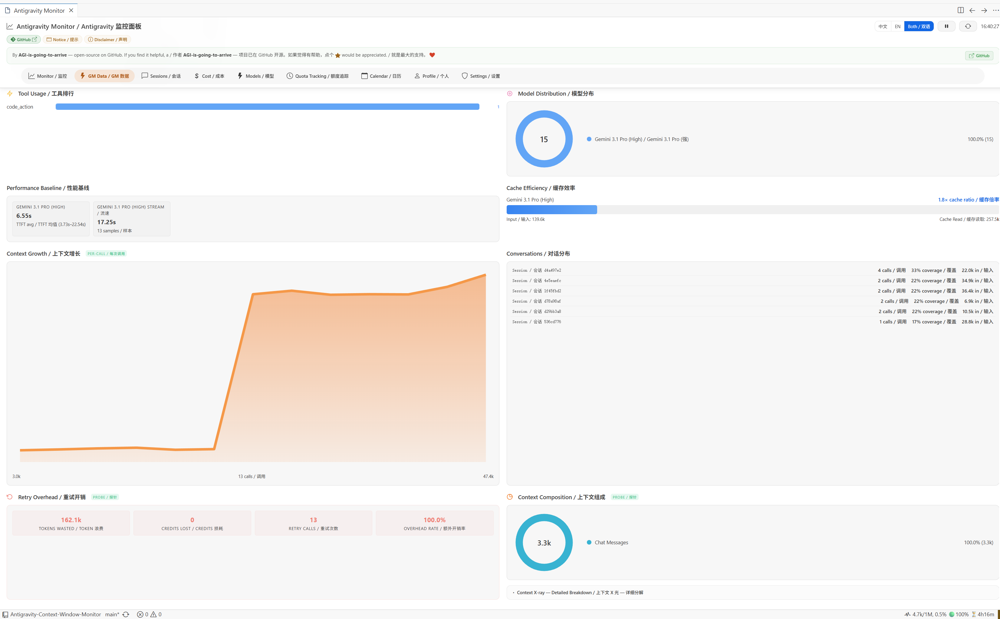

   **会话 (Sessions)** — 浏览所有对话会话，查看上下文用量、步骤数和模型信息。

   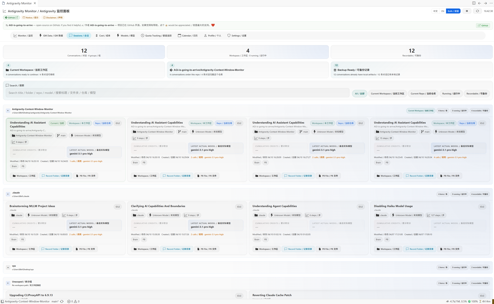

   **成本 (Cost)** — 月度成本分拆，按模型定价、成本概览可视化，以及覆盖已调用模型和内置默认价格模型的自定义价格编辑器。

   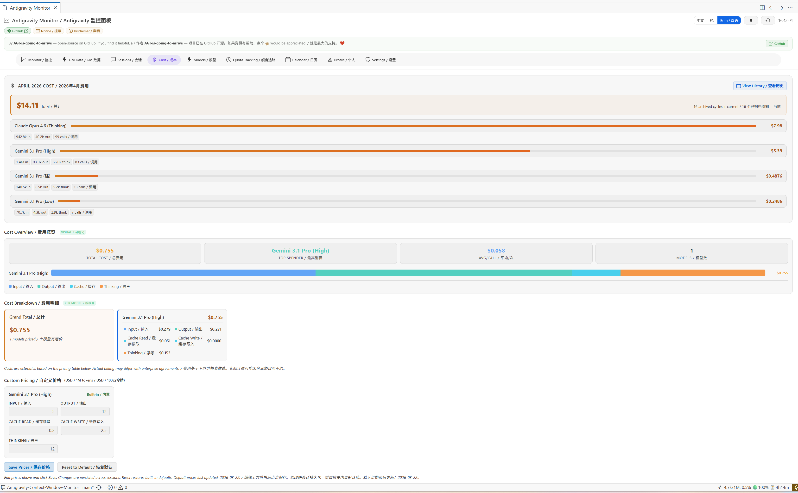

   **模型 (Models)** — 当前账号可用模型的额度状态和重置倒计时。新版模型信息卡片采用协调的 IDE 中性色，用清晰的数据行呈现压缩上限和原生上下文，显示易读的提供商名称、完整模型 ID 及自适应思考状态；支持窄面板、亮色/暗色/高对比度主题和中文、英文、双语显示。

   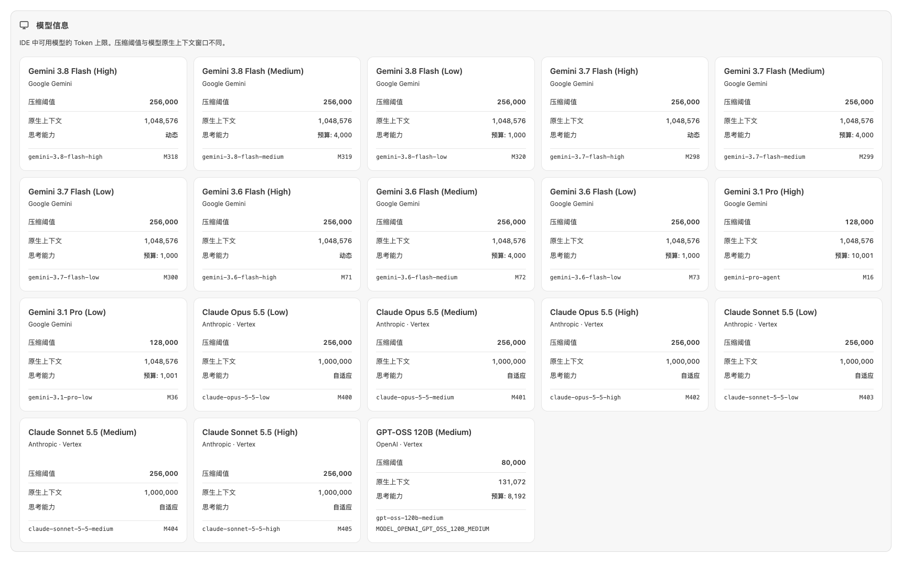

   **日历 (Calendar)** — 按日期组织的历史使用数据，包含每周期成本和 Token 分解。

   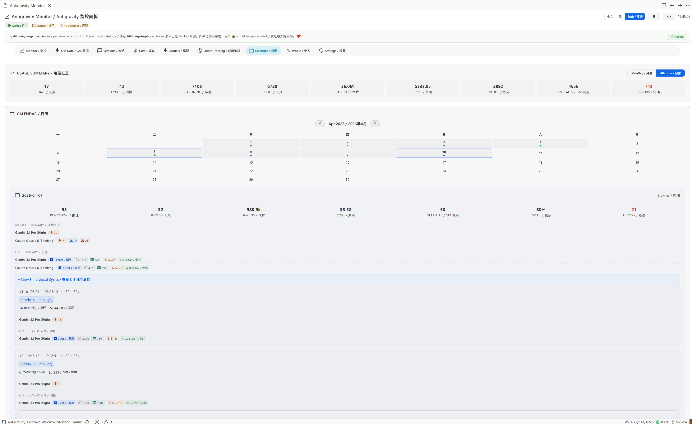

   **个人 (Profile)** — 账户信息、计划详情和额度余额。

   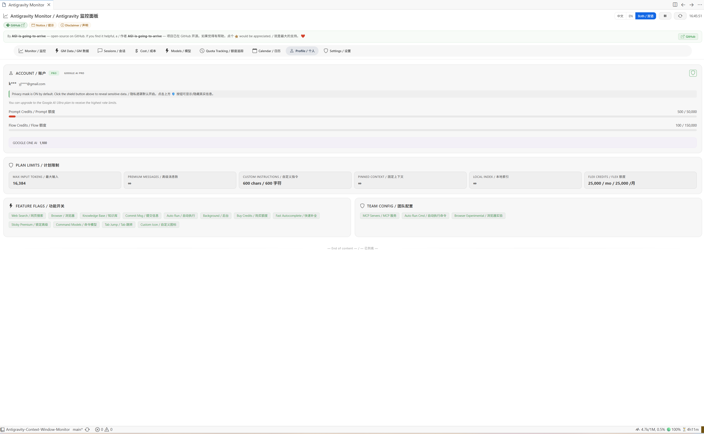

   **设置 (Settings)** — 配置扩展行为：低额度警告阈值、状态栏开关、轮询间隔等。

   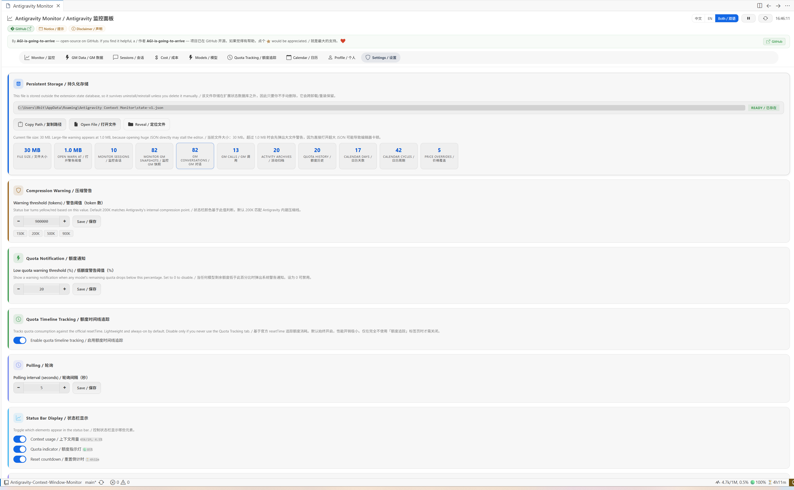

   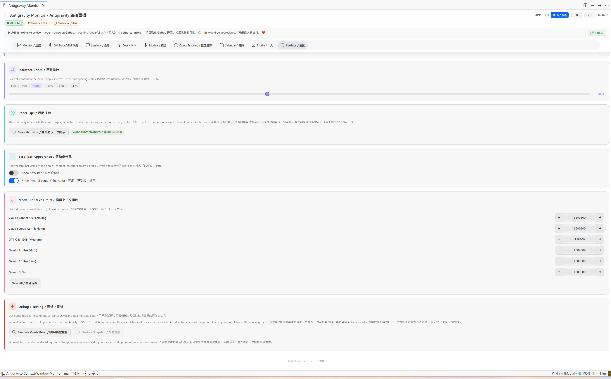

## ⚠️ 已知限制

> [!IMPORTANT]
> **同一工作区多窗口**
> 如果在**同一个文件夹**上打开多个 Antigravity 窗口，它们共享相同的 workspace URI，会话数据可能会混合。
>
> **解决方法**: 不同窗口打开不同的文件夹。

> [!NOTE]
> **上下文压缩提示**
> 压缩完成通知（🗜 图标）持续约 15 秒（3 个轮询周期）后恢复正常显示。

> [!IMPORTANT]
> **Antigravity 内部总结机制**
> Antigravity IDE 对检查点总结有一个硬编码的 7500 token "总结阈值" (Summarization Threshold)。这意味着当对话非常长且跨过该阈值后，Token 计数可能会出现轻微偏差。更多细节请参考 [Reddit 社区讨论](https://www.reddit.com/r/google_antigravity/comments/1q7zcag/heres_how_to_find_which_mcp_tools_are_leading_to/)。

> [!NOTE]
> **子智能体动态切换**
> 使用 Claude 模型时，Antigravity 可能会调用轻量子智能体模型处理小任务——平台把该模型标注为 **Gemini 3.1 Flash Lite**（`MODEL_PLACEHOLDER_M50`；较早的 `gemini-2.5-flash*` 目录条目共用同一显示名）。子智能体切换不会改变显示的上下文上限，因为本扩展跟踪的是你所选模型的上限。Claude 5.5 的原生上下文为 1,000,000 token、平台压缩上限为 256,000 token（2026-10-03 核实）；保留的 Claude 4.6 画像分别为 250,000 和 160,000，子智能体模型使用 128,000 画像。

> [!IMPORTANT]
> **"LS not found" 与请勿以管理员身份运行 IDE（Windows）**
> 若状态栏卡在 `LS not found`，请打开 **Output → "Antigravity Context Monitor"**，查看 `PATH check:` 那一行——扩展现在会记录究竟是哪一步发现失败。自 v1.16.13 起，扩展以 `%SystemRoot%` 绝对路径调用 `wmic`/`powershell.exe`/`netstat`，因此 Extension Host 的 `PATH` 被裁剪（例如 Win11 24H2+ 移除 WMIC 后缺少 `System32\wbem`）不再导致发现失败。
> 自 v1.16.16 起另有两个成因被处理（issue #64，由 @SecretLUL 报告）：Windows 会本地化 `netstat` 的 State 列，德文安装上 `LISTENING` 显示为 `ABHÖREN`，此前所有候选行都会被拒绝；以及监听在全部网卡而非仅环回上的语言服务器，此前完全取不出端口。两者均已修复；若扩展宿主本身运行在 WSL 内部，现在会优先在该发行版中查找语言服务器。
> **请勿以管理员身份运行 Antigravity** —— 这对检测毫无帮助（LS 发现无需提权），还可能导致 IDE 启动崩溃并报 `The window terminated unexpectedly (reason: 'launch-failed', code: '18')`；该崩溃属于 Electron/Chromium 沙箱问题，与本扩展无关。

## ⚙️ 设置

| 设置项 | 默认 | 说明 |
| --- | --- | --- |
| `pollingInterval` | 5 | 轮询频率（秒） |
| `statusBar.showContext` | true | 状态栏显示上下文用量（如 `45k/1M, 4.5%`） |
| `statusBar.showQuota` | true | 状态栏显示当前模型额度指示灯（如 `🟢85%`） |
| `statusBar.showResetCountdown` | true | 状态栏显示重置倒计时（如 `⏳4h32m`） |
| `quotaNotificationThreshold` | 20 | 模型剩余额度低于此百分比时弹出警告（设为 0 可禁用） |
| `activity.maxRecentSteps` | 100 | 活动时间线最多保留的操作条数 |
| `activity.maxArchives` | 20 | 活动归档最多保留份数 |

## 🔤 命令

| 命令 | 说明 |
| --- | --- |
| `Show Context Window Details` | 打开 QuickPick 面板显示所有被追踪的会话 |
| `Refresh Context Window Monitor` | 重新发现语言服务器并重启轮询 |
| `Switch Display Language` | 选择仅中文、仅英文或双语显示模式 |
| `Show Model Activity` | 打开监控面板的 GM 数据标签页 |

## ⭐ Star History / Star 趋势

## 🔗 友情链接

- [LINUX DO](https://linux.do/)

---
**作者**: AGI-is-going-to-arrive
**版本 / Version**: 1.16.18 — [发布说明](docs/releases/1.16.18.md)
