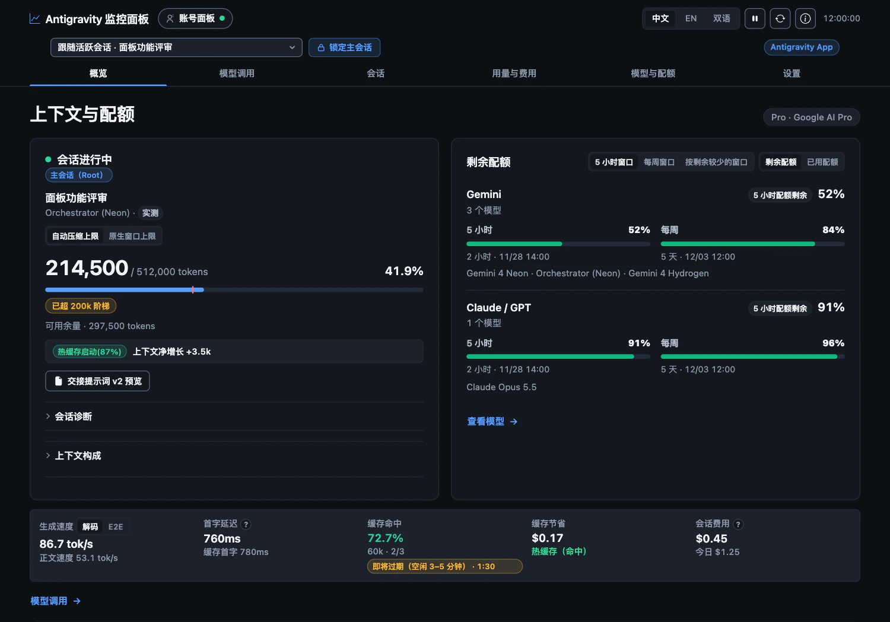
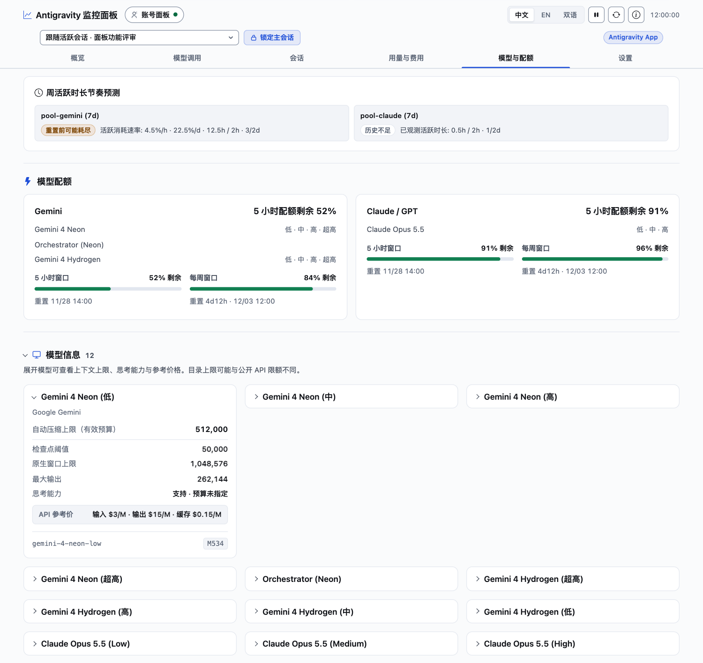
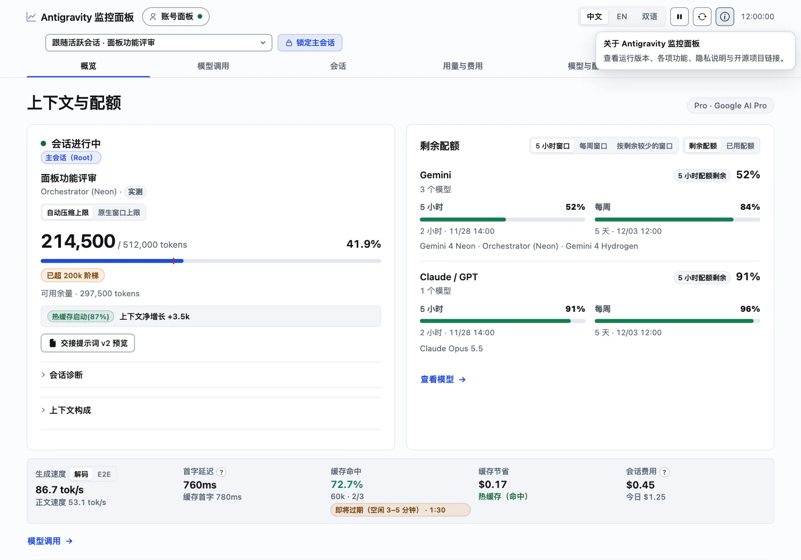
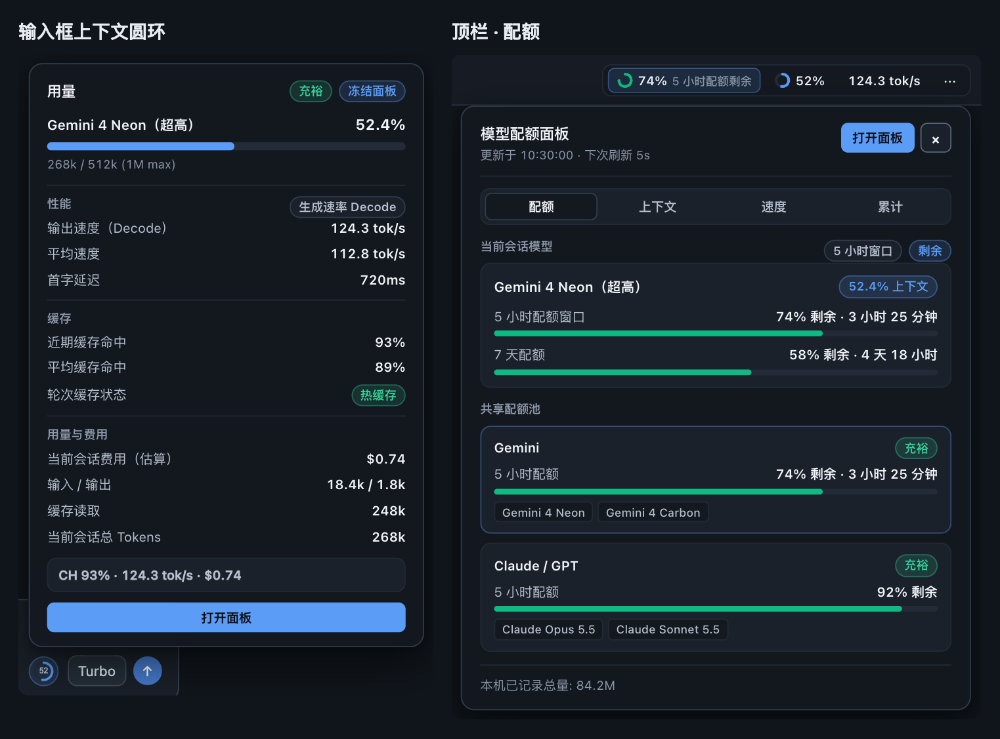

# Antigravity 上下文窗口监控

在 Antigravity App 和 IDE 中查看当前会话还剩多少上下文。你可以逐次查看模型调用、跟踪子智能体、核对缓存与参考费用，也可以查看 5 小时和每周配额的重置时间。`agy` CLI 用户还可以在终端状态行查看上下文用量。

[English](README.md) · [安装与升级](#三步安装与升级) · [AI 安装指引](AGENTS.md#中文) · [界面实景](#界面实景) · [v1.18.1 发布说明](docs/releases/1.18.1.md#中文) · [变更日志](CHANGELOG.md#1181-中文)

**中文演示 · 54 秒**

https://github.com/user-attachments/assets/ec0e1ff2-88bd-43d3-8eda-c61b3712a47c

[下载高清原片（MP4）](https://github.com/AGI-is-going-to-arrive/Antigravity-Context-Window-Monitor/releases/download/v1.18.1/acm-promo-07-sticker-zh.mp4)

## 能力矩阵

| 能力维度 | Antigravity App（侧边插件 Sidecar） | Antigravity IDE（VSIX 扩展） | `agy` CLI（`statusLine`） |
| --- | :---: | :---: | :---: |
| **宿主形态** | `AUX_PANE`（`/`）+ `SIDEBAR`（`/full`）+ `SKILL.md` | 状态栏 + 悬停摘要 + Webview 面板 | 可选只读 stdin 管道（`agy-statusline.mjs`） |
| **6 主标签页 + 顶栏 `ⓘ`** | 完整支持（`320px–1440px` 零横向滚动 + 首次引导） | 完整支持（4 主题、Nonce IPC、安全快捷键） | 单行终端摘要（兼容 `NO_COLOR`） |
| **统一不可变观测与三字段根锁定** | 概览 / 原生 HUD / CDP 全端同源一致 | 面板与状态栏同源一致 | 共享上下文与 10 币种契约 |
| **Swarm / 子智能体实时跟踪** | 支持 20+ 成员公平轮转与一键查看/返回 | 只读拓扑树与直属/整组费用分列 | 显示活跃子智能体数（`sub:N`） |
| **原生 HUD / 可选 CDP 悬浮层** | 原生 HUD（默认开）+ 可选 CDP（默认关） | 原生 HUD（默认关）+ 状态栏 | 单行安全清洗输出 |
| **全局规则与双向热同步** | `~/.gemini/GEMINI.md` 编辑器 + `state-v1.json` | `~/.gemini/GEMINI.md` 编辑器 + `state-v1.json` | 「用量与费用」只读汇总本地 CLI 日志 |
| **运行时依赖 / 宿主修改** | 零外部 npm 依赖 / 零 `app.asar` 修改 | 零外部 npm 依赖 / 标准 VSIX API | 零外部 npm 依赖 / 纯只读 stdin |

## 三步安装与升级

### 1. Antigravity App（原生侧边插件 — macOS / Windows / Linux）

将下面这一句话发送给任意 AI 编程助手（Antigravity、Claude Code、Codex），或直接运行零克隆安装命令（强制 HTTPS 域名白名单与 fail-closed `SHA256SUMS.txt` 校验）：

> 请阅读 `https://github.com/AGI-is-going-to-arrive/Antigravity-Context-Window-Monitor` 中的 `AGENTS.md`，为我的 Antigravity App 安装或升级 Antigravity Context Monitor。

```bash
# macOS / Linux（curl + node）
curl -fsSL https://raw.githubusercontent.com/AGI-is-going-to-arrive/Antigravity-Context-Window-Monitor/main/scripts/install-app-plugin.mjs -o /tmp/acm-install.mjs && node /tmp/acm-install.mjs --from-github && rm -f /tmp/acm-install.mjs
```

```powershell
# Windows PowerShell（irm + node）
$f = Join-Path $env:TEMP 'acm-install.mjs'; irm 'https://raw.githubusercontent.com/AGI-is-going-to-arrive/Antigravity-Context-Window-Monitor/main/scripts/install-app-plugin.mjs' -OutFile $f; node $f --from-github; Remove-Item $f -Force
```

在 **Customizations → Installed**（`customization://antigravity-context-monitor`）中启用 **Antigravity Context Monitor**，随后通过侧边栏 **`+`** 菜单（`AUX_PANE`）或左侧 **Plugins → Context Monitor**（`SIDEBAR`）打开。覆盖升级运行中的 Sidecar 时，请手动**关闭再重新开启**插件——绝不强杀正在运行的 Antigravity 进程。本地显式安装（`--local-dir` / `--no-remote-fallback`）与状态核验（`--status --check-remote`）详见 [AGENTS.md](AGENTS.md#中文)。

### 2. Antigravity IDE（VSIX 扩展 — macOS / Windows / Linux / WSL）

通过 [Open VSX](https://open-vsx.org/extension/AGI-is-going-to-arrive/antigravity-context-monitor) 安装，或从 [GitHub Releases](https://github.com/AGI-is-going-to-arrive/Antigravity-Context-Window-Monitor/releases) 下载 `antigravity-context-monitor-<version>.vsix` 与 `SHA256SUMS.txt` 后执行：

```bash
antigravity-ide --install-extension antigravity-context-monitor-<version>.vsix --force
```

在 IDE 内执行 **Developer: Reload Window** 安全重载。使用 `Cmd+Alt+M`（macOS）/ `Ctrl+Alt+M`（Windows/Linux）打开面板，`Cmd+Alt+Shift+R` / `Ctrl+Alt+Shift+R` 刷新连接。

### 3. 按需开启的可选增强（零二进制修改）

- **持久化 CDP 悬浮层（App 端，默认关闭）：** 核心侧边面板与原生 HUD 完全无需 CDP。App 首次打开概览页会展示可关闭的**悬浮层与 CDP 引导**横幅，且 App 端**设置 → 悬浮层与 CDP** 提供**一键生成持久化启动器**（或运行 `node scripts/install-app-plugin.mjs --setup-cdp-launcher`），详见 [CDP 悬浮层指南](docs/zh/cdp-overlays.md)。
- **可选只读 `agy` CLI `statusLine`：** 在 `~/.gemini/antigravity-cli/settings.json` 中指向 `~/.gemini/config/plugins/antigravity-context-monitor/bin/agy-statusline.mjs`，详见 [CLI 状态行与遥测指南](docs/zh/telemetry-and-pricing.md)。

## v1.18.1 更新亮点

- **跟踪 `/compact` 之后的上下文。** 压缩后，App 和 IDE 会在有足够数据时显示估算值。模型返回新读数后，面板会更新为实测值。会话进入空闲后，插件也会复查延迟到达的模型调用记录。
- **刷新正在查看的成员。** 手动刷新会重新读取所选会话。只要后端连接相同，IDE 就会保留当前查看的子成员。
- **核对参考费用。** 概览和用量与费用页按账本日期和已记录的模型、调用数据计算已结算用量的参考费用，支持跨调价日和自定义价格。

## 界面实景

[](docs/images/zh/hero-overview.webp)

### 概览 · 多智能体

展开成员详情，可查看它使用的模型、上下文占比和已记录费用。

[](docs/images/zh/overview-swarm.webp)

### 模型调用

对照生成速度、首字延迟和缓存命中率，再查看最近一次调用的明细。

[](docs/images/zh/model-calls.webp)

### 会话

打开会话并展开成员，查看该成员最近一次的监控读数。

[](docs/images/zh/aux-pane-sessions.webp)

### 用量与费用

按工作区查看用量，并核对哪些成员有调用记录。

[](docs/images/zh/usage-cost.webp)

### 模型与配额

查看每周配额预测，展开模型查看上下文上限。

[](docs/images/zh/models-quotas.webp)

### 设置

查看版本更新、配置悬浮层，或打开全局规则编辑器。

[](docs/images/zh/settings-global-rules.webp)

### Antigravity IDE

从 IDE 状态栏打开监控面板，在编辑器旁查看当前会话。

[](docs/images/zh/ide-light.webp)

### App 悬浮层

在对话里展开上下文圆环或顶栏配额指示器，可直接查看详细读数。

[](docs/images/zh/cdp-overlays.webp)

## 阈值速查与常见排错

| 指标 / 现象 | 阈值或行为说明 | 快速排查建议 |
| --- | --- | --- |
| **上下文压力** | 正常 `<65%` · 偏高 `65%–79%` · 高压 `>=80%` · 溢出 `>100%` | 使用**交接指令 v2** 或 `/compact`；`200k` 刻度仅为标准 API 参考线，非订阅额外扣费 |
| **提示词缓存 / 5m TTL** | 实测：热缓存 `>=70%` · 部分 `10%–69%` · 冷启动 `<10%`；TTL 预警 `>=180s`、过期 `>=300s` | 本地 TTL 属空闲计时启发式；结合模型切换、空闲间隔或压缩排查可能未命中原因 |
| **模型配额池** | 充裕 `>=50%` · 偏低 `20%–49%` · 紧张 `<20%`（默认预警阈值 `20%`） | 可切换 `5h`/`7d`/**按剩余较少的窗口** 与 `剩余`/`已用`；周活跃预测需跨 `>=2` 天且累计 `>=2` 活跃小时 |
| **升级后提示 `reloadRequired`** | 磁盘已安装版本/buildId 与运行中 Sidecar 不同 | 打开 `customization://antigravity-context-monitor` 将插件**关闭再重新开启**（严禁强杀宿主） |
| **`CDP 未就绪` / `host_missing_flag`** | 已开启可选 CDP 悬浮层但宿主未带 `--remote-debugging-port` | 在**设置 → 悬浮层与 CDP** 一键生成持久化启动器，完全退出宿主（macOS `Cmd+Q` 后等约 5 秒）重启并点击「重新检测」 |
| **超大对话 / `未归属`** | `>50 MB` 或 `>1,200` 步超长对话，或 v1.18 前缺少工作区归属记录 | 插件会读取超大会话末尾的一段记录。缺少工作区标记的历史调用列在**未归属**中。 |

## 架构与技术合规边界

| 维度 | 客观技术事实 |
| --- | --- |
| **宿主二进制与 `app.asar`** | 零修改、零解包、零补丁、零重签名 `app.asar`、`Info.plist`、`language_server` 或 `agy` |
| **只读遥测与全局规则边界** | 插件在本机处理语言服务器通过 RPC 返回的数据，其中可能包含提示词元数据、文本片段和检查点摘要。CLI 日志用于统计用量，`members.json` 和 `swarm.json` 用于识别成员关系。全局规则编辑器只向 `~/.gemini/GEMINI.md` 保存用户的修改，拒绝符号链接，文件大小上限为 200 KiB。 |
| **凭据与网络边界** | 不提取 CloudCode/Google OAuth Token、不切换账号、不发合成唤醒请求、不外传遥测；唯一可选外网请求为带 ETag 节流的 HTTPS `443` GitHub Releases 更新检查 |
| **可选 CDP 悬浮层** | 默认关闭；仅在用户显式开启并带 CDP 启动时挂载只读 Trusted-Types 安全 Shadow DOM 组件；按窗口绑定 Origin 与最小权限凭据，导航/断开即吊销 |
| **运行时依赖与开源协议** | 零外部运行时 npm 依赖（纯 Node.js 内置模块 + `esbuild` 打包产物）；采用 **MIT** 许可证的开源项目 |

## 进阶文档与协议

项目由 **AGI-is-going-to-arrive** 维护。[架构设计](docs/zh/architecture.md) · [遥测、计价与 CLI 状态行](docs/zh/telemetry-and-pricing.md) · [CDP 悬浮层](docs/zh/cdp-overlays.md) · [设计系统](docs/zh/design.md) · [产品规格](docs/zh/product.md) · [MIT 许可证说明](docs/zh/license.md)

## 致谢

感谢 @gitstq 贡献全局规则编辑器，也感谢 @GHTGXL 提供 Windows 超大会话崩溃和更新目录被占用的排查记录。[PR #78](https://github.com/AGI-is-going-to-arrive/Antigravity-Context-Window-Monitor/pull/78) · [Issue #79](https://github.com/AGI-is-going-to-arrive/Antigravity-Context-Window-Monitor/issues/79)

感谢 [LINUX DO 社区](https://linux.do/)。
